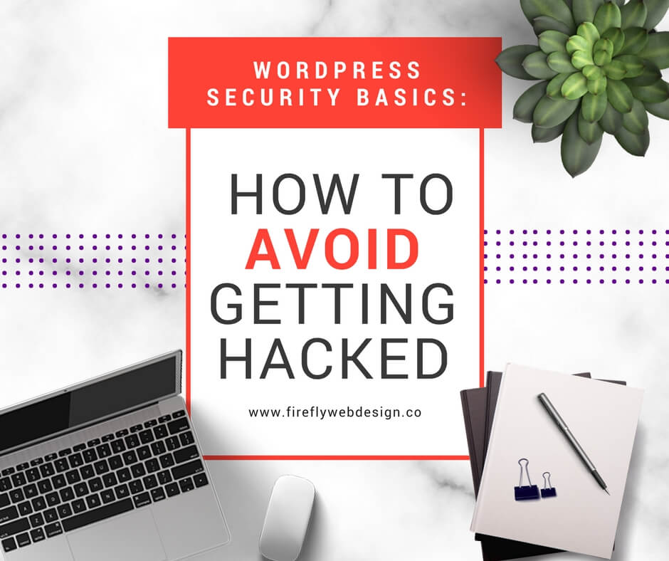
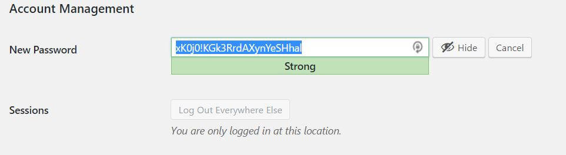
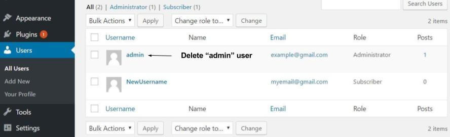
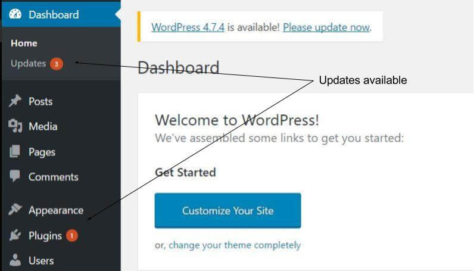

You've spent hours setting up your new WordPress website and you're celebrating. You're not alone. WordPress is the most popular content management system in the world, accounting for 27% of all websites. Sounds awesome! But being popular also has its drawbacks, like being a popular target for hackers.

Today you're going to learn 6 simple things you can do to keep your WordPress website safer from hackers.

## 1\. Secure Passwords

The easiest way for unauthorised users to gain access to your website is by guessing your password. So if your password is your birthday, dog or kids names (or heaven forbid “password”), you’re leaving yourself wide open.

A secure password should include:

- At least 8 characters;
- Numbers as well as letters; and
- A special character.

WordPress actually provides a secure password generator, so you don’t even have to think of one yourself.

To use this feature, login to your Dashboard and go to **Users > Your Profile**.

Scroll down to _“Account Management”_ and next to _“New Password”,_ click the _“Generate Password”_ button.

This will generate a long and secure password for you.

Write this password down somewhere safe (or save it to your password manager) and then click “_Update Profile”_ at the bottom_._ Done!

## 2\. Change the Default Username

When WordPress is first installed, it creates a generic user named “admin” (unless you change the default settings). Leaving your username as “admin” gives would be hackers one half of your username/password combo.

There are a few ways to change your username, but the easiest is to create a new user (with administration privileges) and then delete the “admin” user.

This easily can be done through your dashboard “Users” tab.

## 3\. Limit Login Attempts

A “brute force” attack is when a person or computer program attempts to login over and over again, trying many different username/password combinations. To combat these attacks, you can limit the number of times a person (or bot!) can attempt to login to your WordPress dashboard.

There are a number plugins that do this specifically, and most general security plugins such as WordFence will have this function. (And don’t worry, you can still recover your password if you lose or forget it.)

## 4\. Keep WordPress and Plugins Updated

The WordPress application and associated plugins are updated regularly, and although it can be annoying seeing that little red button come up so often – there is a good reason for this. Whenever a security vulnerability is discovered, the WordPress team work around the clock to release an update that closes the security loop hole.

If you’re not updating WordPress and your plugins when they become available, you are leaving yourself exposed to known security risks.

## 5\. Delete Themes and Plugins Not In Use

So you’ve downloaded 10 different themes and 20 different plugins to try out on your new website. You’ve finally found your perfect theme and the best plugins, but what did you do with the ones that weren’t the right fit? If you’re like most people, you’ve left them in your themes and plugins folders gathering dust.

The more themes and plugins you have installed, the higher your risk of an unscrupulous hacker messing with your site. (Not to mention the effect of slowing down the speed of your website.)

If you’re not using a plugin or theme you should deactivate _and_ delete.

## 6\. Backups

This tip doesn’t actually prevent you people gaining access to your site, but it is one of the most often overlooked part of a security plan. If your website is compromised and you don't have a recent clean backup, there's going to be tears! You absolutely need to ensure there are regular backups of your website ready to be restored.

A simple free option I recommend is [UpDraft](https://updraftplus.com/). It is easy to use and set up automatic scheduling for your backups. It can even send the backups directly to your cloud Dropbox or Google accounts.

## Conclusion

The truth is that everything on the internet is hackable (even NASA and the pentagon!). Although there are more advanced measures you can use to secure your site, taking these  6 basic precautions will make you less of a target and reduce the likelihood of discovering your website has been held ransom by malicious software.
